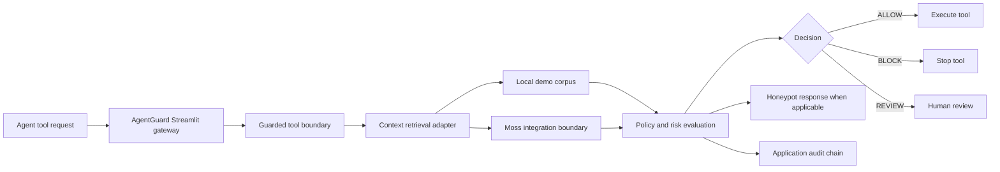

# AgentGuard Architecture

## Product goal

AgentGuard is a runtime safety gateway for transaction-oriented AI agents. It evaluates an action against retrieved context before the action is executed and records explainable evidence.

## Current implementation

## Moss role

The retrieval adapter is the boundary where Moss should provide fast semantic context retrieval. The current repository runs in `LOCAL_DEMO` mode because Moss credentials or SDK access are not configured. The UI and result payload expose this mode explicitly so local measurements are not presented as Moss measurements.

When Moss access is available, the adapter should return the retrieved policy or transaction context, match metadata, and measured retrieval latency. The policy evaluator should use that result in the same decision path.

## Decision contract

Every guard result should expose:

- `decision`: `ALLOW`, `BLOCK`, or future `REVIEW`
- `reason`: human-readable policy explanation
- `retrieval_mode`: active retrieval implementation
- `latency`: measured retrieval latency in milliseconds
- `trust`: normalized context trust score
- `doc` and `vendor`: retrieved evidence

The ledger is an application-level hash chain for audit evidence. It is not an external blockchain.
