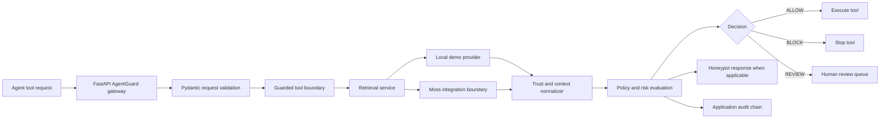

# AgentGuard Architecture

## Product goal

AgentGuard is a runtime safety gateway for transaction-oriented AI agents. It evaluates an action against retrieved context before the action is executed and records explainable evidence.

## Current implementation

The Streamlit application is the visual demonstration client. The FastAPI service in `api.py` is the gateway layer for programmatic agent requests. Both paths use the same retrieval service and policy core.

## Moss role

The retrieval adapter is the boundary where Moss should provide fast semantic context retrieval. The current repository runs in `LOCAL_DEMO` mode because Moss credentials or SDK access are not configured. The UI and result payload expose this mode explicitly so local measurements are not presented as Moss measurements.

`src/moss_client.py` is the provider-specific boundary. It reads `MOSS_PROJECT_ID` and `MOSS_PROJECT_KEY` only at runtime from environment configuration or Streamlit Secrets and does not expose either value to the UI, audit ledger, or decision payload. When Moss access is available, the adapter returns the retrieved policy or transaction context, match metadata, and measured retrieval latency. The policy evaluator uses that result in the same decision path.

Missing configuration falls back to `LOCAL_DEMO` for the public demonstration. A configured-but-failing or unimplemented Moss request returns `MOSS_ERROR` with zero trust, so sensitive actions fail closed rather than being allowed on missing evidence.

## Implemented service boundaries

- `src/moss_client.py` — Moss provider boundary and server-side secret lookup
- `src/retrieval_service.py` — retrieval orchestration and provider selection
- `src/retrieval_models.py` — normalized retrieval response contract
- `src/local_retrieval.py` — explicitly labeled local demo provider
- `src/moss_validator.py` — retrieval selection and policy evaluation
- `src/context_normalizer.py` — stable, bounded context contract
- `src/review.py` — pending human-review queue for `REVIEW` decisions
- `src/honeypot.py` — suspicious blocked-request trace
- `src/blockchain.py` — application hash-chain audit ledger

The review queue is currently in-memory for the prototype. A production deployment should replace it with a durable review service while keeping `REVIEW` non-executable by default.

## Decision contract

Every guard result should expose:

- `decision`: `ALLOW`, `BLOCK`, or `REVIEW`
- `reason`: human-readable policy explanation
- `retrieval_mode`: active retrieval implementation
- `latency`: measured retrieval latency in milliseconds
- `trust`: normalized context trust score
- `doc` and `vendor`: retrieved evidence

The ledger is an application-level hash chain for audit evidence. It is not an external blockchain.
